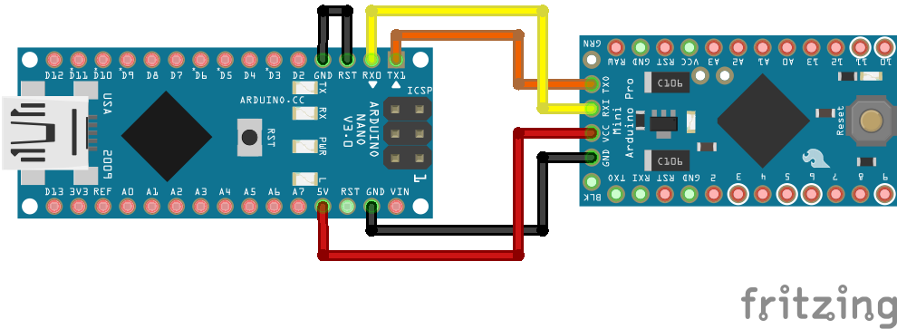
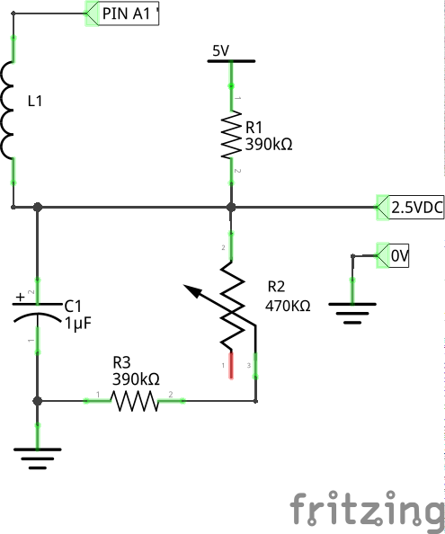
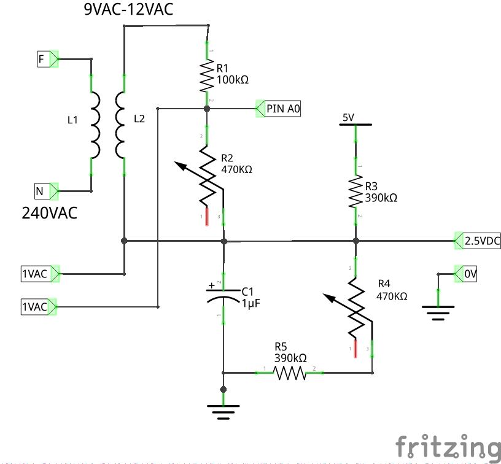

# Home Net System

## Hardware and Programming

### Upload code on Arduino Pro mini 5v 16MHz

Once started upload throught **$ make upload**, need to reset Arduino Pro mini by pressing his reset button

Source:https://www.youtube.com/watch?v=lyd_jVJIDs0

## Power Sensor

To measure power consumption, we need a current sensor (SCT-013-030) and a voltage sensor (AC-AC power adapter) (normal transformer 240VAC to 9VAC or 12VAC)

### Current Sensor

**Sensor used:**  SCT-013-030 (Shop http://ebmstore.it/index.php?route=product/product&product_id=1352&search=SENSORE+CORRENTE) 

**Circuit Scheme:**  

**Circuit Calibration:** We use a trimmer to obtain accurate measurements.  
Step to calibrate:  

- Measure real supply voltage (5V)
- Measure voltage on pin labeled (2.5VDC) with ground as reference. Turn trimmer to obtain exactly half of supply voltage 

**EmonLib Calibration:** Parameter ICAL is current [A] measured with 1 VAC as output of sensor. In case of use SCT-013-030 is just 30.0 (Other type of sensor need to calculate ICAL according to burder resistor used, see link source below) 

### Voltage Sensor

**Sensor used:** Just normal transformer 230V 50Hz - 12V 500mA  
**Circuit Scheme:**  

**Circuit Calibration:** We use a two trimmers to obtain accurate measurements. 
Step to calibrate:  

- Measure real supply voltage (5V)
- Measure voltage on pin labeled (2.5VDC) with ground as reference. Turn trimmer R4 to obtain exactly half of supply voltage
- Measure voltage on two pins (1VAC). Turn trimmer R2 to obtain exactly 1 VAC

**EmonLib Calibration:** Parameters are VCAL and PHASECAL, this last is not easy to compute so we use default value 1.7 (represent delay caused by ADC time).   VCAL indicates AC voltage when output of transformer is 1VAC, to calcolate this is needed a AC voltmeter. Since AC voltage is unstable, can't be easy to measure same value occurred during 1VAC calibartion in *Circuit Calibration*  
**NOTE:**  During *Circuit Calibration* you might think to measure AC voltage when pin (1VAC) is exactly 1VAC, and use this value for VCAL. Unfortunately it doesn't work, infact, in my case, using VCAL=242.7, i get wrong voltage samples also try to change PHASECAL. 
In following image there are measurements of multimeter (photos are taken with 20 seconds of delay, AC in that moment was fairly stable) 

In my case, use VCAL=236.5 get good results (see data below)

Source:

- https://learn.openenergymonitor.org/electricity-monitoring/ctac/how-to-build-an-arduino-energy-monitor  
- https://learn.openenergymonitor.org/electricity-monitoring/voltage-sensing/measuring-voltage-with-an-acac-power-adapter  
- https://learn.openenergymonitor.org/electricity-monitoring/ct-sensors/interface-with-arduino  
- https://learn.openenergymonitor.org/electricity-monitoring/ctac/ct-and-ac-power-adaptor-installation-and-calibration-theory?redirected=true  

### EmonLib choose number of half wave

In following function we need to choose parameter *crossings* that indicates number of half wave to measure. 

  *void* EnergyMonitor::**calcVI**(unsigned int *crossings*, unsigned int *timeout*)  

Of course, increase *crossings* we obtain higher accuracy, but increase also time required to measure, so we need to find a tradeoff.  

We measure error of voltage and current measurements with different *crossing* and obtain following result:  

| Crossing            | Voltage Error        | Current Error        | Tool Voltage Accuracy | Tool Current Accuracy |
| ------------------- | -------------------- | -------------------- | --------------------- | --------------------- |
| **20**              | 0.728 %              | 1.341 %              | 0.8 %                 | 2.5 %                 |
| **14**              | 0.924 %              | 1.697 %              | 0.8 %                 | 2.5 %                 |
| **<mark>12</mark>** | <mark>0.701 %</mark> | <mark>1.051 %</mark> | <mark>0.8 %</mark>    | <mark>2.5 %</mark>    |
| **10**              | 0.811 %              | 1.109 %              | 0.8 %                 | 2.5 %                 |
| **08**              | 0.819 %              | 1.128 %              | 0.8 %                 | 2.5 %                 |

**Data Path:**./Tests/software/EmonLib_Test/TEST/0504